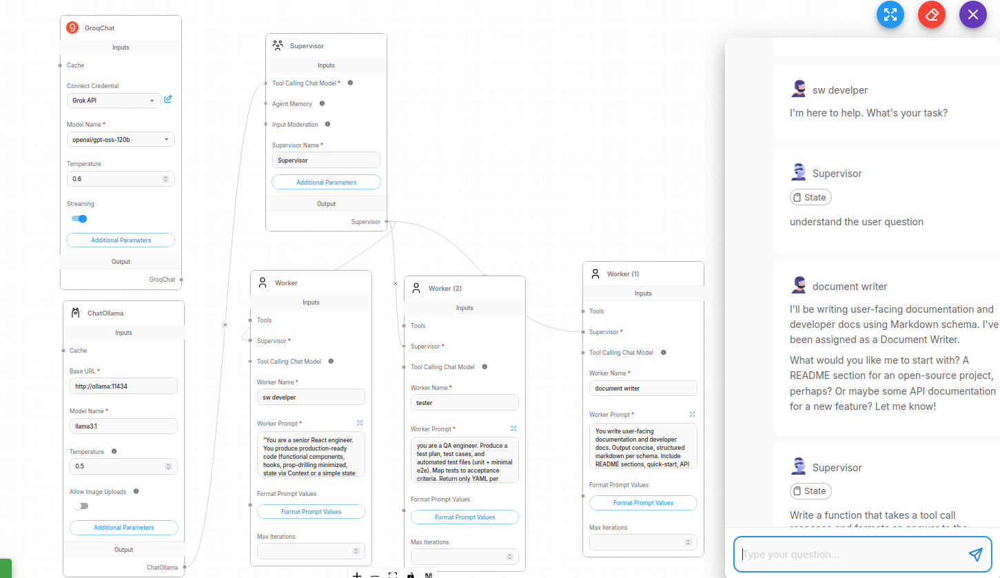

# Flowise Multi‑Agent Workflow

**Goal:** Build a multi‑agent Flowise system where three workers collaborate on a feature:

* **Worker 1: React Developer** (implements UI & client logic)
* **Worker 2: Tester** (writes test plan + automated tests, reviews acceptance)
* **Worker 3: Documentation** (writes README, usage guide, API docs, changelog)
* **Manager/Orchestrator Agent** (splits tasks, routes messages/artifacts, merges outputs)

---

## 1) High‑Level Architecture

1. **User Input** → short feature brief or user story.
2. **Manager Agent** decomposes the work into tickets and calls each Worker subflow.
3. **Workers** produce artifacts: code snippets, test cases, docs blocks.
4. **Manager** validates, requests fixes if needed, aggregates results.
5. **Output**: zipped handover (spec, code blocks, tests, docs + changelog).

> **Implementation in Flowise**: Use **one main Chatflow (Manager)** that calls **three child Chatflows (Workers)** via **HTTP Request** nodes hitting Flowise’s REST API for those child flows.
> [](https://youtu.be/dsdyUiO6wd8)


---

## 2) Build It in Flowise (Step‑by‑Step)

### A) Create 3 Worker Chatflows (subflows)

> Each Worker chatflow = **LLM** + (optional) **Knowledge Base** + **Prompt Template** + **Memory**.

* **Common settings**

  * LLM: any chat model you use in Flowise.
  * Memory: Conversation Buffer (so the worker can iterate).
  * Tools (optional): Web Search (for examples/standards), Vector DB (project guidelines).
  * **Input**: JSON with `ticket`, `context`, `constraints`, and `previousArtifacts`.
  * **Output**: strictly‑formatted YAML (see §4 Message Protocol).

#### Worker 1 — React Developer Chatflow

* **System Prompt (core)**

  * “You are a senior React engineer. You produce production‑ready code (functional components, hooks, prop‑drilling minimized, state via Context or a simple state library if needed). You return only the requested artifacts in the required YAML schema. Prefer accessibility (ARIA), responsiveness, error boundaries, and clean folder structure.”
* **Tasks (see §3)**
* **Return**: code blocks, folder tree, TODO list, assumptions.

#### Worker 2 — Tester Chatflow

* **System Prompt (core)**

  * “You are a QA engineer. Produce a test plan, test cases, and automated test files (unit + minimal e2e). Map tests to acceptance criteria. Return only YAML per schema.”
* **Return**: test‑plan, test‑cases, jest/vitest files, Playwright/Cypress skeleton, bug risks.

#### Worker 3 — Documentation Chatflow

* **System Prompt (core)**

  * “You write user‑facing documentation and developer docs. Output concise, structured markdown per schema. Include README sections, quick‑start, API docs, ADRs, and changelog entries.”
* **Return**: README.md, USAGE.md, API.md, CHANGELOG.md entries, ADR(s).

> **Save** each chatflow and note their **Chatflow IDs**.

---

### B) Create the Manager/Orchestrator Chatflow

**Nodes:**

1. **Input** node (Feature Brief).
2. **Prompt Template** (Manager System): defines roles, DoD, acceptance criteria, and output schemas.
3. **LLM** (Manager): produces tickets and routing plan.
4. **HTTP Request (→ React Dev Subflow)**
5. **HTTP Request (→ Tester Subflow)**
6. **HTTP Request (→ Docs Subflow)**
7. **LLM (Manager – Aggregator)**: merges workers’ YAML into final package; verifies DoD.
8. **Output** node.

**HTTP Request configuration:**

* **Method:** POST
* **URL:** `http://<FLOWISE_HOST>/api/v1/prediction/<ReactDev_ChatflowId>` (repeat for Tester, Docs)
* **Headers:** `Content-Type: application/json`
* **Body (example):**

```json
{
  "question": "${manager_payload_for_worker}",
  "overrideConfig": {
    "sessionId": "${run_id}",
    "returnSourceDocuments": false
  }
}
```

* **manager_payload_for_worker** is a JSON string you build from the Manager LLM: includes `ticket`, `context`, `constraints`, and any `previousArtifacts`.

**Aggregation:**

* After the three HTTP nodes, collect their JSON/YAML, pass to the Manager LLM with a strict “merge & validate” prompt.

---

## 3) Roles, Tasks & DoD

### Worker 1 — React Developer (React + Vite)

* **Inputs:** User story, UI spec, API contract (if any).
* **Deliverables:**

  * **Folder structure:**

    * `src/components/` (atomic components)
    * `src/pages/`
    * `src/hooks/`
    * `src/context/`
    * `src/lib/` (api.ts, utils)
    * `src/styles/`
  * **Code:** Functional components, hooks, state management, routing, form handling, API calls.
  * **Quality:** Accessibility basics, responsive layout, error boundaries, loading states.
  * **Developer Notes:** decisions/assumptions, TODOs, risks.
* **Definition of Done:**

  * Runs locally with `npm run dev`.
  * Lints cleanly; passes TypeScript (if used).
  * Satisfies acceptance criteria & renders sample data.

### Worker 2 — Tester (QA)

* **Inputs:** Dev artifacts + acceptance criteria.
* **Deliverables:**

  * **Test Plan** (scope, risks, environments).
  * **Test Cases** (traceability to criteria).
  * **Automated Tests**:

    * Unit tests (Jest/Vitest).
    * E2E smoke (Playwright/Cypress) for critical paths.
  * **Bug/Edge list** + priorities.
* **Definition of Done:**

  * All critical cases covered; tests pass locally (`npm test`, `npm run e2e:headless`).
  * Coverage note for key files/components.

### Worker 3 — Documentation

* **Inputs:** Dev + Test outputs.
* **Deliverables:**

  * `README.md` (Overview, Quick Start, Scripts, Folder Tree).
  * `USAGE.md` (feature walkthrough with screenshots placeholders).
  * `API.md` (endpoints/contracts, request/response examples).
  * `ADR-0001.md` (key decisions e.g., Vite + React + Testing stack).
  * `CHANGELOG.md` (Keep a Changelog, SemVer style).
* **Definition of DoD:**

  * Newcomer can run the app in <5 minutes.
  * API docs match code and tests.

### Manager/Orchestrator

* **Responsibilities:**

  * Break brief → tickets; route to workers; check schemas; request fixes.
  * Merge YAML outputs; generate final package & release notes.
* **Definition of Done:**

  * All worker DoDs satisfied; no schema violations; final bundle ready.

---

## 4) Message Protocol (Strict Schemas)

> All inter‑agent messages must follow these YAML schemas to avoid ambiguity.

**Manager → Worker (ticket schema):**

```yaml
role: manager
feature: <short title>
context:
  product_goal: <why>
  user_story: <as_a / i_want / so_that>
  constraints:
    - <constraint 1>
    - <constraint 2>
artifacts_from_others:
  dev_code: |
    <optional code or stubs>
  tests: |
    <optional tests>
  docs: |
    <optional docs>
acceptance_criteria:
  - <Given/When/Then 1>
  - <Given/When/Then 2>
outputs_required:
  - <what this worker must return>
```

**Worker → Manager (generic return schema):**

```yaml
role: <react_dev|tester|docs>
summary: <3-5 bullet points>
artifacts:
  - path: <relative/path>
    type: <code|markdown|json|test>
    content: |
      <file content>
risks:
  - <risk + mitigation>
open_questions:
  - <question>
next_actions:
  - <clear next step>
```

---

## 5) Prompts (Copy‑Paste)

### Manager System Prompt

> “You are the project manager and orchestrator in a multi‑agent software delivery pipeline. Your job: (1) decompose the feature brief into tickets; (2) route tickets to the correct worker subflow (React Dev, Tester, Docs) via HTTP; (3) enforce the YAML schemas; (4) request fixes when acceptance criteria or schemas are violated; (5) merge final outputs. Never produce informal text—only YAML following the defined schemas.”

### React Developer System Prompt

> “You are a senior React engineer. Use functional components, hooks, modular structure, and accessibility best practices. For APIs provide `lib/api.ts` stubs. Return only YAML with artifacts (code files), risks, and next actions. Prefer Vite, TypeScript, ESLint. Provide clear TODOs where external data is unknown.”

### Tester System Prompt

> “You are a QA engineer. Create a concise test plan, traceable test cases, and minimal automated tests (unit + one e2e). Map each test case to acceptance criteria. Return only YAML with artifacts and risks. Prefer Jest/Vitest and Playwright.”

### Docs System Prompt

> “You write user and developer documentation. Output README.md, USAGE.md, API.md, ADR, CHANGELOG entry. Provide only YAML with markdown artifacts. Ensure quick‑start runs.”

---

## 6) Example Run

**Input (user brief):** “Add a Todo list page with create/complete/delete, persisted to localStorage, and a basic filter. Mobile responsive.”

**Manager** → emits 3 tickets (Dev, Test, Docs).

* **Dev** returns `src/pages/Todos.tsx`, `src/components/TodoItem.tsx`, `src/lib/storage.ts`, etc.
* **Test** returns Jest tests for `storage.ts` and Playwright e2e for add/complete/delete.
* **Docs** returns README quick‑start + USAGE instructions.
* **Manager** merges into a single handover and verifies each acceptance criterion.

---

## 7) CI & Handoffs (Optional but Recommended)

* **GitHub Integration:** Use Manager → **HTTP Request** to call GitHub API to create a branch/commit/PR with returned artifacts.
* **CI:** Trigger GitHub Actions to run tests (Jest/Playwright). Post status back to Manager.
* **Notifications:** Slack/Email via Webhook node when DoD is met.

---

## 8) RACI (Quick)

| Activity                    | Manager | React Dev | Tester  | Docs    |
| --------------------------- | ------- | --------- | ------- | ------- |
| Ticketing & routing         | **R**   | C         | C       | C       |
| UI implementation           | C       | **A/R**   | C       | I       |
| Test plan & automation      | C       | C         | **A/R** | I       |
| Documentation               | C       | C         | C       | **A/R** |
| Final merge & release notes | **A/R** | C         | C       | C       |

---

## 9) Checklists

**React Dev DoD**

* [ ] Components accessible & responsive
* [ ] Error & loading states
* [ ] Lint/Typecheck clean
* [ ] Meets acceptance criteria

**Tester DoD**

* [ ] Test plan + traceability
* [ ] Unit tests for core logic
* [ ] 1 E2E critical path
* [ ] All pass locally

**Docs DoD**

* [ ] Quick Start works
* [ ] Usage examples
* [ ] API contracts match code
* [ ] ADR + Changelog

---

## 10) Tips for Smooth Runs

* Keep outputs in **strict YAML** to let Manager parse & merge.
* Store shared guidelines (coding style, folder naming) in a **Vector DB** and attach as a tool to all Workers.
* If a Worker flags a blocker, Manager re‑issues a refined ticket with the answered question.
* Prefer **small tickets** to minimize rework.

---

# README — Deployment & Troubleshooting (GitHub‑ready)

> Copy this section into your project `README.md`.

## Overview

This repository contains a **Flowise multi‑agent workflow** with a **Manager** orchestrator and three workers:

* **React Developer** (UI implementation)
* **Tester** (QA plan + automated tests)
* **Documentation** (README/USAGE/API/ADR/CHANGELOG)

It uses **Ollama** for on‑device LLMs and runs fully in **Docker**.

## Prerequisites

* Docker + Docker Compose
* ~8GB RAM minimum (CPU inference)

## Quick Start

### 1) `docker-compose.yml`

```yaml
version: "3.8"
services:
  ollama:
    image: ollama/ollama:latest
    container_name: ollama
    ports:
      - "11434:11434"
    environment:
      - OLLAMA_NUM_PARALLEL=1
      - OLLAMA_MAX_LOADED_MODELS=1
    volumes:
      - ollama_data:/root/.ollama
    restart: unless-stopped

  flowise:
    image: flowiseai/flowise:latest
    container_name: flowise-1
    ports:
      - "3000:3000"
    environment:
      - PORT=3000
      - DATABASE_PATH=/root/.flowise
      - FLOWISE_USERNAME=admin
      - FLOWISE_PASSWORD=admin123
    volumes:
      - flowise_data:/root/.flowise
    depends_on:
      - ollama
    restart: unless-stopped

volumes:
  ollama_data:
  flowise_data:
```

Start services:

```bash
docker compose up -d
```

### 2) Pull a small, CPU‑friendly model inside the **ollama** container

```bash
docker exec -it ollama ollama pull llama3.2:3b-instruct
```

List models (should include `llama3.2:3b-instruct`):

```bash
docker exec -it ollama ollama list
```

### 3) Verify from host

```bash
curl -s http://localhost:11434/api/tags
curl -N http://localhost:11434/api/generate \
  -d '{"model":"llama3.2:3b-instruct","prompt":"Say hi"}'
```

### 4) Verify from inside **Flowise** container (internal Docker network)

```bash
docker exec -it flowise-1 sh -lc 'apk add --no-cache curl || true; curl -s http://ollama:11434/api/tags'
```

If you see JSON with your model(s), networking is OK.

### 5) Configure Flowise LLM node

* **Provider:** Ollama
* **Base URL:** `http://ollama:11434`
* **Model:** `llama3.2:3b-instruct` (or any that appears in `/api/tags`)
* **Streaming:** On
* **Timeout:** `300000 ms`

> If you already downloaded larger models (`llama3.1:latest`, `llama2:latest`) and you’re on CPU, prefer the small **3B** model above to reduce latency/timeouts.

## Running the Multi‑Agent Flow

1. Open Flowise at `http://localhost:3000` and import/create the **Manager** chatflow + three worker chatflows (React Dev, Tester, Docs).
2. Set each worker’s system prompt and schemas (see `/docs` or canvas notes).
3. In the Manager flow, call workers via **HTTP Request** nodes targeting `/api/v1/prediction/<child_chatflow_id>` with a JSON body containing the ticket payload.
4. Aggregate YAML outputs, validate against acceptance criteria, and display/return the merged handover.

## Troubleshooting

* **Flowise shows no responses / feels “stuck”:**

  * Ensure Flowise LLM node **Base URL** is `http://ollama:11434` (Docker service name, **not** `localhost`).
  * Use a **small model** on CPU: `ollama pull llama3.2:3b-instruct` and set it in the node.
  * Increase **Timeout** and enable **Streaming**.
* **Model not found** in logs:

  * The model name in Flowise must exactly match one from `/api/tags`.
* **Network errors (ECONNREFUSED/EAI_AGAIN):**

  * From Flowise container: `curl -s http://ollama:11434/api/tags` → if it fails, the service name may differ. Check `docker compose ps` and adjust.
* **Reverse proxy (Nginx) drops streaming (SSE):**

  ```nginx
  proxy_read_timeout 600s;
  proxy_send_timeout 600s;
  proxy_buffering off;
  ```
* **Port already in use:**

  * Find process: `sudo lsof -i :11434` or `:3000` → stop conflicting service or change the mapped port.

## Sanity Commands

```bash
# Host → check tags
curl -s http://localhost:11434/api/tags

# Host → generate text
curl -N http://localhost:11434/api/generate \
  -d '{"model":"llama3.2:3b-instruct","prompt":"Say hi"}'

# Flowise container → reach Ollama by service name
docker exec -it flowise-1 sh -lc 'curl -s http://ollama:11434/api/tags'
```

## Notes

* For embeddings, you can use `nomic-embed-text` or `bge-m3` (already shown in `/api/tags`).
* Keep `OLLAMA_MAX_LOADED_MODELS=1` on low‑RAM machines to avoid swapping/evictions.

---
